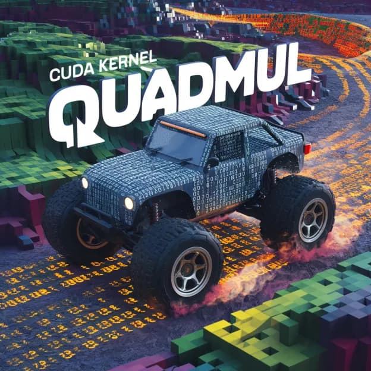

# QuadMul — CUDA Int4 Tensor Core GEMM

  

This int4 gemm kernel gets speeds faster than cuBLAS FP16 and cublas int8. It's also relatively easy to read, hack, fuse, and do whatever you want with.

Hopper and Ada GPUs have fp8 support, but GPUs going back to even the Turing gen have int4 tensor core support.

You can install it for yourself with `pip install .` and then run the tests with `python test.py`.

I tuned for kernels for an A40, so if you're using another device the configs might be less than optimal and you'd need to autotune them for said device.

Benchmarks are in `/benchmarks`:

---

## License

MIT